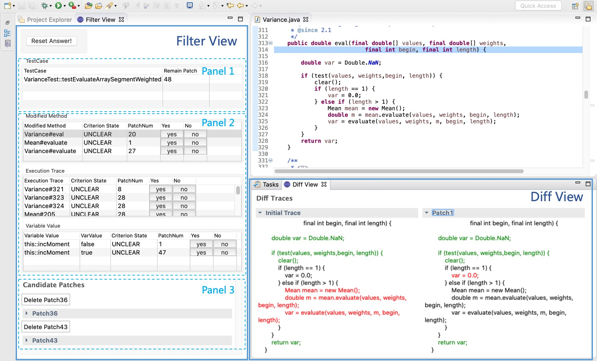
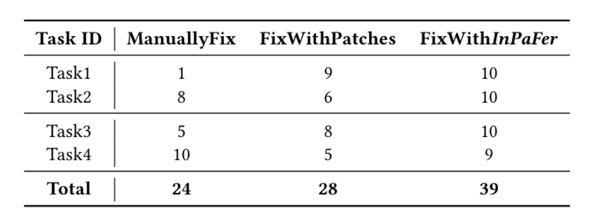

# InPaFer

* I. Introduction of InPaFer
* II. Environment setup
* III. Run InPaFer Step-by-Step
* IV. Evaluation Result for User Stury
* V.Structure of the project

## I. Introduction
*InPaFer* is an interactive patch filtering approach to provide tool support for patch revie and debugging. We implemented our approach as an Eclipse plugin project, which includes a user interface to allow the developer to easily browse the patches and the questions, as well as a diff view to visualize the effect of a patch on a test execution.
The following figure is the screenshot of our approach.




## II. Environment

* OS: macOS Catalina (version 10.15.3)
* JDK: Oracle jdk1.8 (**important!**)
* IDE: Eclipse (version 4.11.0)
* Download and configure Defects4J (**branch  [fee5ddf020](https://github.com/rjust/defects4j/tree/fee5ddf020d0ce9c793655b74f0ab068153c03ef)**) running environment.

## III. How to run

#### Before running

* Configure the following path in File [Constant.java](./src/patchfilter/model/config/Constant.java).

  * HOME="homoe_of_this_project"
  * PROJECT_HOME="home_of_data"
  * COMMAND_JAVA_HOME="home_of_java7"
  * COMMAND_D4J="home_of_defects4j_command"
  * D4J_HOME="home_of_defects4j"

* Download the project which you want to run to path `PROJECT_HOME/ProjectName/ProjectName_Bugid_buggy`.
  
  * Notice that the path of project need follow above format. For example, if you want to run math41, you may download the source code of math41 to `PROJECT_HOME/Math/Math_41_buggy`.


#### Step 1, Obtain the extra information

* Run the Main class `patchfilter.model.Main.PatchVariationMain`:

   `Run As`→`Run Configurations…` →`Arguments` : set the following arguments as Program Arguments.

   		* `-project` : the project name of buggy program of benchmark. (`-project=Math` for the example)
   		* `-start` : the bug id of start running project. (`-start=41` for the example)
   		* `-end` : the bug id of end running project. (`-end=41` for the example)

   	After running the class `patchfilter.model.Main.PatchVariationMain`, you will obtain two directories: cache and tmp, for the next step.


#### Step 2, Run the plugin project

* From the project file:
	* `Run As` -> `Eclipse Application`: a new eclipse will be opened.
	* Import the project from the new eclipse.
	* Select the imported project and `Window` -> `Show View` -> `Other` -> `Sample Category` -> `Query View` and  `Diff View`.


## IV.Evaluation

To evaluate the usefulness of InPaFerin a realistic program repair scenario, we conducted a user study. We recruited 30 participants to conduct our user study. In order to alleviate the threats from participants and encourage them to carefully finish the experiment, we will pay more than 40% if the participant can successfully fix one bug.

Overall, FixWithInPaFer can reduce the debug-ging time by 25.3% and 28.0% on average, and increase thesuccess rate by 62.5% and 39.3% on average, compared to ManuallyFix and FixWithPatches, respectively.

|  |  |
| :--------------------------------------: | :--------------------------------------: |
| The Number of successfull debugging sessions. |              Debugging time.              |


## V. Structure

```powershell
  |--- README.md   :  user guidance
  |--- bin         :  binary code
  |--- d4j-info    :  defects4j information
  |--- figure      :  some figures used in readme.md
  |--- icon        :  icons used in plugin
  |--- lib         :  dependent libraries
  |--- FinalPatch  :  the patches used in experiment
  |--- src         :  source code
```
----

